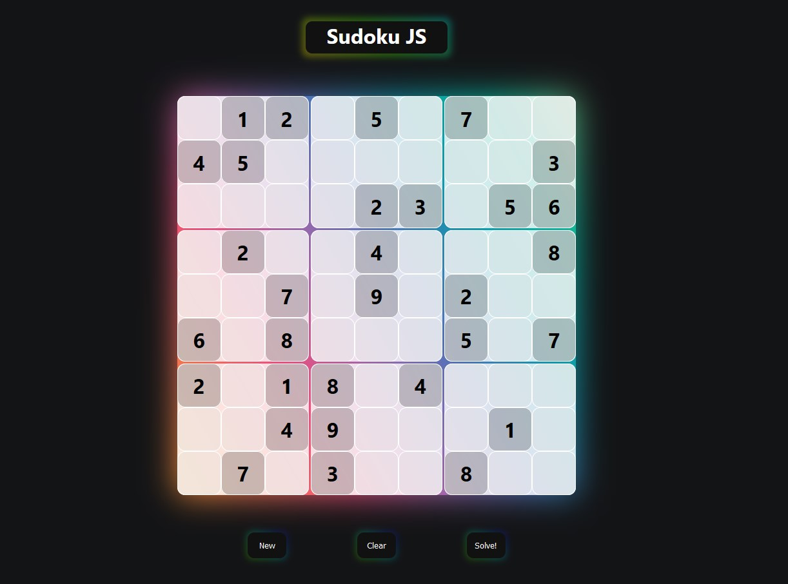

<style>
  header {
    margin: 0;
    padding: 0;
    width: 100%;
    height: 15vh;
    display: flex;
    flex-direction: row;
    justify-content: center;
    align-items: center;
  }

  #title {
    width: 170px;
    height: 30px;
    border: none;
    outline: none;
    color: #fff;
    background: #111;
    position: relative;
    z-index: 0;
    border-radius: 100px;
  }

  #title:before {
    content: '';
    background: linear-gradient(45deg, #ff0000, #ff7300, #fffb00, #48ff00, #00ffd5, #002bff, #7a00ff, #ff00c8, #ff0000);
    position: absolute;
    top: -6px;
    left: -6px;
    background-size: 400%;
    z-index: -1;
    filter: blur(5px);
    width: calc(100% + 12px);
    height: calc(100% + 12px);
    animation: glowing 20s linear infinite;
    opacity: 0.3;
    transition: opacity .3s ease-in-out;
    border-radius: 10px;
  }

  #title:after {
    z-index: -1;
    content: '';
    position: absolute;
    width: 100%;
    height: 100%;
    background: #111;
    left: 0;
    top: 0;
    border-radius: 10px;
  }

  @keyframes glowing {
    0% {
      background-position: 0 0;
    }
    50% {
      background-position: 400% 0;
    }
    100% {
      background-position: 0 0;
    }
  }
</style>

<br />
<p align="center">
  
  <header>
    <h1 id="title" align="center">Sudoku JS</h1>
  </header>

  <p align="center">
    A Sudoku puzzle with solver built in React.
    <br />
    <a href="https://malkrad.github.io/sudoku"><strong>Try it yourself »</strong></a>
    <br />
  </p>
</p>


<!-- ABOUT THE PROJECT -->
## About The Project



A Sudoku puzzle built with ReactJS with a fast implemented solver,\
I know there are a lot of Sudokus out there, but none looks as beautiful 😎


<!-- Features -->
## Features

* **Randomly generated Sudoku puzzles**, that are 100% solvable.
* Choose the cell you want to change **per click** or the **keyboard arrows**.
* Simple inputing using the **keybaord numbers** (use 0 to delete a cell).
* Reset the current puzzle using the **Clear** button.
* Solve the puzzle with a Backtracking Algorithm using **Solve** button.
* Make new puzzles using the **New** button.
* Discover wrong entered values and hinting them.
* Celebrating correctly solved puzzles :)


<!-- GETTING STARTED -->
## Getting Started

For a live preview you can visit [Sudoku JS](https://malkrad.github.io/sudoku).

OR

You can follow those steps to deploy it locally:

* Clone the project using:
```
git clone https://github.com/malkrad/sudoku.git
```
* Move into the project folder:
```
cd sudoku
```
* Install dependencies using:
```
npm install
```
* Start the local server:
```
npm start
```
* 🥳🥳🥳, you made it, you can visit [localhost:3000](http://localhost:3000) in your browser to enjoy.


<!-- LICENSE -->
## License

Distributed under the MIT License. See `LICENSE` for more information.


<!-- CONTACT -->
## Contact

Twitter - [@mo_alkrad](https://twitter.com/mo_alkrad)

LinkedIn - [@malkrad](https://www.linkedin.com/in/malkrad/)

Project Link: [https://github.com/malkrad/sudoku](https://github.com/malkrad/sudoku)


<!-- ACKNOWLEDGEMENTS -->
## Acknowledgement
* [Best-README-Template](https://github.com/othneildrew/Best-README-Template)
